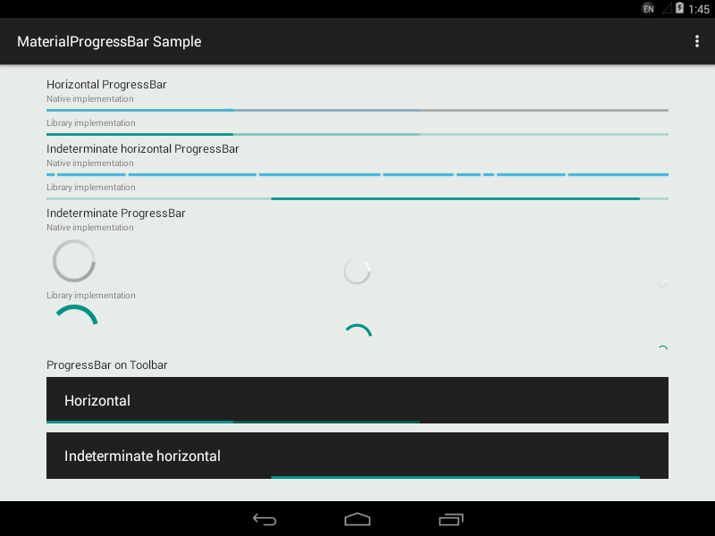

# MaterialProgressBar

Material ProgressBar consistent on all Android platforms.

## Screenshot

Android 4.4

Samsung Android 5.0.1 (with bug in tinting)

Android 5.1.1

## Integration

[Sample application APK](dist/sample.apk)

[Library AAR](dist/library.aar)

## Usage

Three material style `Drawable`s are backported to Android 4.0 (Ice Cream Sandwich), so you can create one and set it directly on your `ProgressBar`.

- [`ProgressHorizontalDrawable`](library/src/main/java/me/zhanghai/android/materialprogressbar/ProgressHorizontalDrawable.java)
- [`ProgressIndeterminateHorizontalDrawable.java`](library/src/main/java/me/zhanghai/android/materialprogressbar/ProgressIndeterminateHorizontalDrawable.java)
- [`ProgressIndeterminateDrawable.java`](library/src/main/java/me/zhanghai/android/materialprogressbar/ProgressIndeterminateDrawable.java)

In order to assign your `ProgressBar` the correct size on all versions, you need to use one of the styles this library provided. The trick inside it is `android:minHeight`, `android:maxHeight` (and width) that controls the `Drawable` size.

- `Widget.MaterialProgressBar.ProgressBar.Horizontal`
- `Widget.MaterialProgressBar.ProgressBar`
- And more size and no-padding variants in [styles.xml](library/src/main/res/values/styles.xml)

For a detailed example, you can refer to the `onCreate()` method of the sample's [`MainActivity`](sample/src/main/java/me/zhanghai/android/materialprogressbar/sample/MainActivity.java) and its layout [main_activity.xml](sample/src/main/res/layout/main_activity.xml).

## Pre-ICS versions

Neither Support v4 nor AppCompat v7 backports animation API to versions prior tot ICS, and the [NineOldAndroids](https://github.com/JakeWharton/NineOldAndroids/) has already been deprecated since people should all be using `minSdkVersion="14"`now, so versions older than ICS are not supported.

## License

    Copyright 2015 Zhang Hai

    Licensed under the Apache License, Version 2.0 (the "License");
    you may not use this file except in compliance with the License.
    You may obtain a copy of the License at

       http://www.apache.org/licenses/LICENSE-2.0

    Unless required by applicable law or agreed to in writing, software
    distributed under the License is distributed on an "AS IS" BASIS,
    WITHOUT WARRANTIES OR CONDITIONS OF ANY KIND, either express or implied.
    See the License for the specific language governing permissions and
    limitations under the License.
