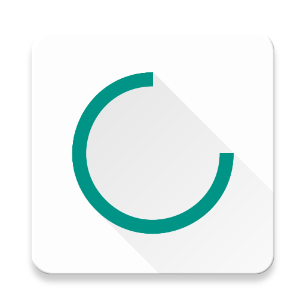
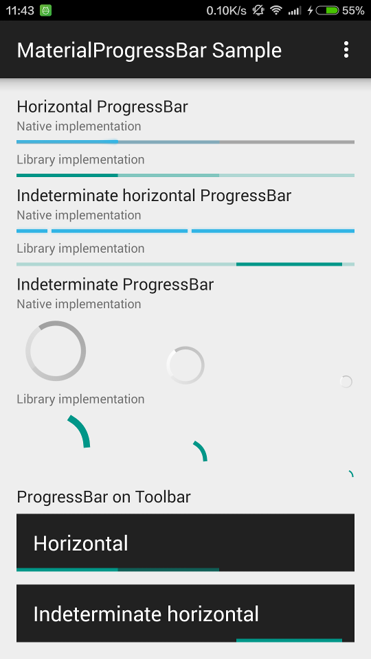
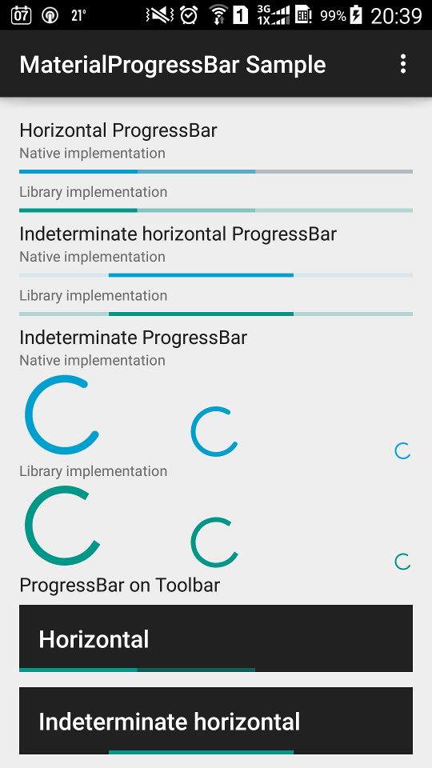
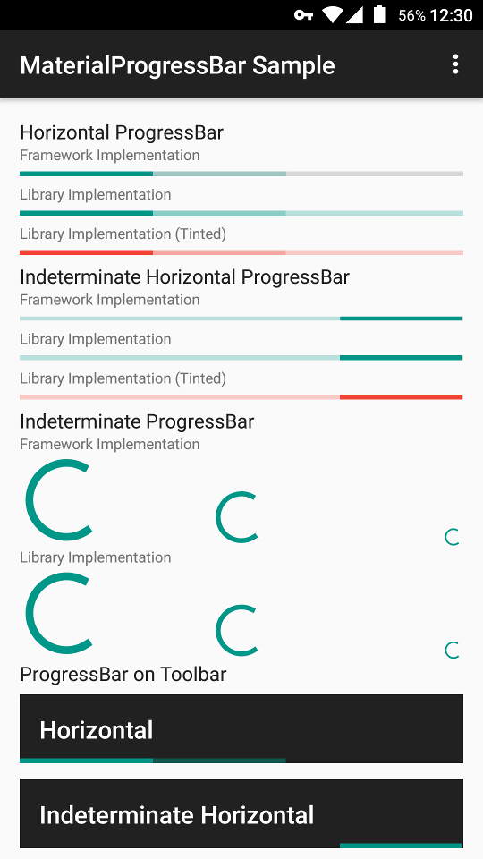

# MaterialProgressBar



Material Design `ProgressBar` with consistent appearance on Android 4.0+.

## Why MaterialProgressBar?

- Consistent appearance on Android 4.0+.
- Correct tinting across platforms.
- Able to remove the intrinsic padding of framework `ProgressBar`.
- Able to hide the progress background of framework horizontal `ProgressBar`.
- Able to show a determinate circular progress.
- Used as a drop-in replacement for framework `ProgressBar`.

## Preview

<a href="https://play.google.com/store/apps/details?id=me.zhanghai.android.materialprogressbar.sample" target="_blank"></a>

[Sample APK](//github.com/zhanghai/MaterialProgressBar/releases/download/v1.6.1/sample-release.apk)

Android 4.4.4



Samsung Android 5.0.1 (native implementation fails to tint)



Android 6.0.1



## Integration

Gradle:

```gradle
implementation 'me.zhanghai.android.materialprogressbar:library:1.6.1'
```

## Usage

You can either simply use the [`MaterialProgressBar`](library/src/main/java/me/zhanghai/android/materialprogressbar/MaterialProgressBar.java) widget, or set drawables from this library on a regular `ProgressBar`.

### Using Widget

Simply replace your `ProgressBar` with `MaterialProgressBar`, and remember to apply corresponding style and attribute for correct behavior.

For example, to create an indeterminate horizontal `MaterialProgressBar`:

```xml
<me.zhanghai.android.materialprogressbar.MaterialProgressBar
    android:layout_width="wrap_content"
    android:layout_height="wrap_content"
    android:indeterminate="true"
    app:mpb_progressStyle="horizontal"
    style="@style/Widget.MaterialProgressBar.ProgressBar.Horizontal" />
```

In order to make your `ProgressBar` take the correct and consistent size on all versions, you will always need to use one of the styles from this library. The trick inside it is `android:minWidth`, `android:maxWidth` (and height) that controls the drawable size.

- `Widget.MaterialProgressBar.ProgressBar`
- `Widget.MaterialProgressBar.ProgressBar.Horizontal`
- And more size and no-padding variants in [styles.xml](library/src/main/res/values/styles.xml)

Available custom attributes:

- `app:mpb_progressStyle`: Style of progress drawable: `circular` or `horizontal`. Defaults to `circular`.
- `app:mpb_setBothDrawables`: Whether both determinate and indeterminate drawables should be set on this progress bar. Defaults to `false` (for performance). Should be set to `true` if you want to use both of the backported determinate and indeterminate drawables.
- `app:mpb_useIntrinsicPadding`: Whether progress drawable should use its intrinsic padding. Defaults to `true`.
- `app:mpb_showProgressBackground`: Whether progress drawable should show a progress background. Defaults to `true` for horizontal progress drawable, `false` otherwise.
- `app:mpb_determinateCircularProgressStyle`: Style of determinate circular progress drawable: normal or dynamic. Defaults to `normal`.

8 tint-related attributes such as `app:mpb_progressTint` and `app:mpb_progressTintMode` are also supported so that they can control the tinting of progress drawables. The default tint color is `?colorControlActivated`, and the default tint mode is `src_in`.

For a detailed example, you can refer to the [sample app's layout](//github.com/zhanghai/MaterialProgressBar/blob/master/sample/src/main/res/layout/main_activity.xml), where you can find examples such as removing progress padding or background.

### Using Drawable

Three Material Design drawables are backported to Android 4.0 (API 14), so you can create one and set it directly on your `ProgressBar`.

- [`HorizontalProgressDrawable`](library/src/main/java/me/zhanghai/android/materialprogressbar/HorizontalProgressDrawable.java)
- [`IndeterminateHorizontalProgressDrawable`](library/src/main/java/me/zhanghai/android/materialprogressbar/IndeterminateHorizontalProgressDrawable.java)
- [`CircularProgressDrawable`](library/src/main/java/me/zhanghai/android/materialprogressbar/CircularProgressDrawable.java)
- [`IndeterminateCircularProgressDrawable`](library/src/main/java/me/zhanghai/android/materialprogressbar/IndeterminateCircularProgressDrawable.java)

For example, to set a `IndeterminateHorizontalProgressDrawable` on a `ProgressBar`.

```java
progressBar.setIndeterminateDrawable(new IndeterminateHorizontalProgressDrawable(this));
```

You will also need to set a style from this library as in the section above.

For example, to define an indeterminate horizontal `ProgressBar`.

```xml
<ProgressBar
            android:id="@+id/indeterminate_horizontal_progress"
            android:layout_width="match_parent"
            android:layout_height="wrap_content"
            android:indeterminate="true"
            style="@style/Widget.MaterialProgressBar.ProgressBar.Horizontal" />
```

Don't forget to create and set the drawable as above.

You can also customize the behavior of these drawables by calling `setShowBackground()` and `setUseIntrinsicPadding()`. Tint-related methods `setTint()`, `setTintList()` and `setTintMode()` are also backported so that you can use them directly, but remember to take these drawables as their actual type or `TintableDrawable` because VM won't be able to find these methods on `Drawable` for legacy platforms.

If you want to support API level < 18, you'll need to workaround a canvas limitation as in [here](https://github.com/zhanghai/MaterialProgressBar/blob/0eee874b6fbd109eda2be01b7887647e589dcd9d/library/src/main/java/me/zhanghai/android/materialprogressbar/MaterialProgressBar.java#L122); Using `MaterialProgressBar` does this automatically.

For a detailed example, you can refer to the `onCreate()` method of the old sample's [`MainActivity`](//github.com/zhanghai/MaterialProgressBar/blob/7529ea854a04207fcbf768aa574110e49c511867/sample/src/main/java/me/zhanghai/android/materialprogressbar/sample/MainActivity.java) and its layout [main_activity.xml](//github.com/zhanghai/MaterialProgressBar/blob/7529ea854a04207fcbf768aa574110e49c511867/sample/src/main/res/layout/main_activity.xml).

## ProGuard

The AAR of this library has already included a ProGuard configuration file to make `ObjectAnimator` work properly.

## Older versions

Neither Support v4 nor AppCompat v7 backported animation API to versions prior to ICS, and the [NineOldAndroids](https://github.com/JakeWharton/NineOldAndroids/) library has already been deprecated since people should all be using `minSdkVersion="14"` now, so versions older than ICS are not supported.

## License

    Copyright 2015 Hai Zhang

    Licensed under the Apache License, Version 2.0 (the "License");
    you may not use this file except in compliance with the License.
    You may obtain a copy of the License at

       http://www.apache.org/licenses/LICENSE-2.0

    Unless required by applicable law or agreed to in writing, software
    distributed under the License is distributed on an "AS IS" BASIS,
    WITHOUT WARRANTIES OR CONDITIONS OF ANY KIND, either express or implied.
    See the License for the specific language governing permissions and
    limitations under the License.
